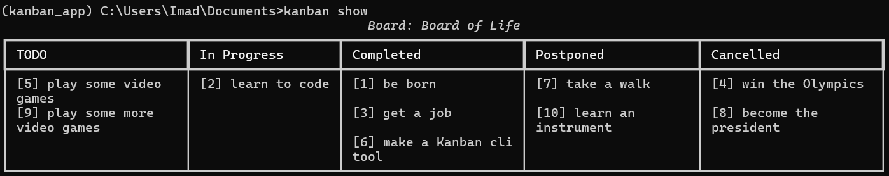

# Kanban_app

## Installation
Clone the repo, and ensuring you are within the project directory and a 
clean environment, enter:
```bash
pip install -e .
```

## Usage
Below are some of the entry commands, which have further prompts when
necessary 

### Task Commands

Create a task:
```bash
kanban add [optional task_name/task_number]
```
Read a task:
```bash
kanban see <required task_name/task_number>
```
Update a task:
```bash
kanban update <required task_name/task_number>
```
Delete a task:
```bash
kanban remove <required task_name/task_number>
```

### Board Commands

Create a board:
```bash
kanban create [optional board_name]
```
Show all boards:
```bash
kanban boards
```
Activate a board:
```bash
kanban activate <required board_name>
```
Read a board:
```bash
kanban show <required board_name>
```
Delete a board
```bash
kanban delete <required board_name>
```

## Example
Below is an example of a filled in board:
